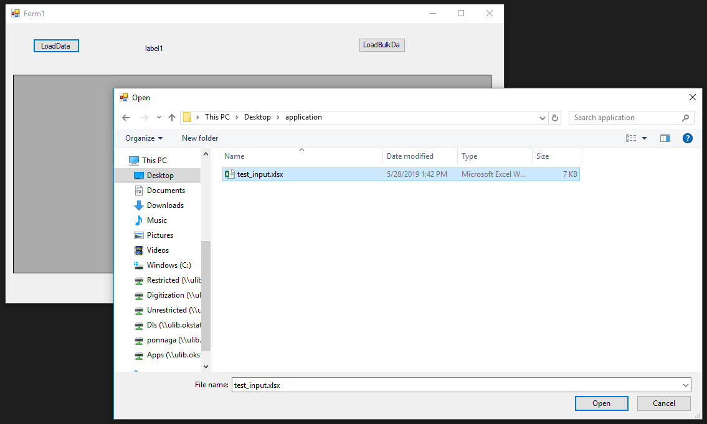
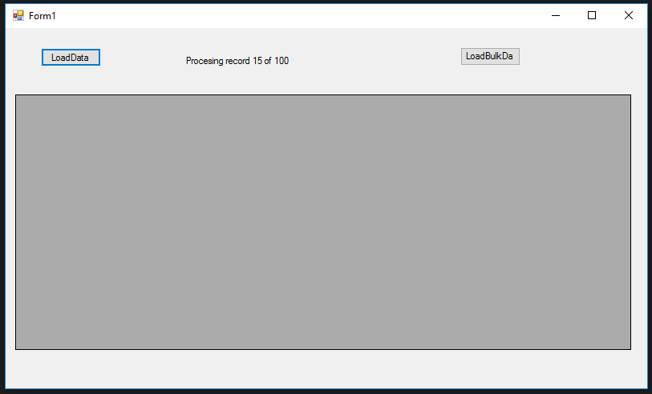
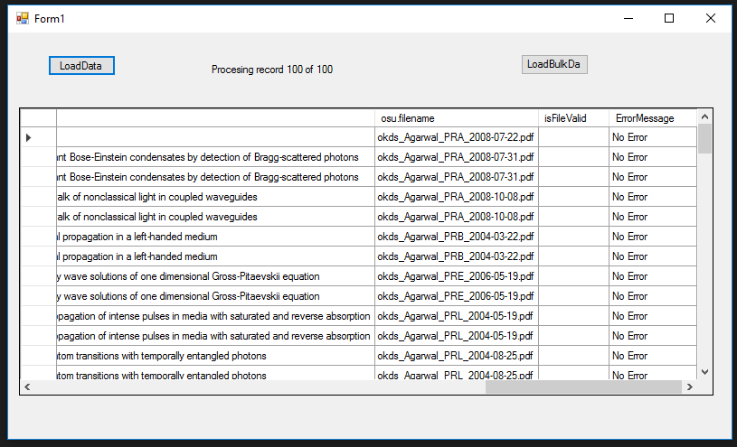

# shareOkForms

## Description
This application crawls the URLs in shareOK which is Oklahoma State University's Dspace and validates them and their content  against its metadata in a CSV file. 

Below are the validations done by the application:

* Is the URL active/dead 
* Does the URL have an attachment
* Does the URL have the right attachment. Is the name of the attachment same as that in the metadata CSV file.
* If there are any duplicate URLs for the same article it does the following validations
	* Is at least one of the URL working
	* Does at least one of the URL have an attachment and does at least one of them have right attachment

## Application walkthrough 
1. The screen below shows the application when its started. Clicking on 'LoadData' button will open up a dialog where input CSV file containing metadata can be selected

 *ProTip: If you want to load multiple files at a time, use 'LoadBulkData' button*
 
 

2. The screen below shows the application under execution. The application is processing one entry of metadata at a time. The status text shows the number of URLs processed by the application from the CSV file. 
 
 
  
3. The Screen below shows the error message. The application puts an error message which reads "No Error" in the error message column to indicate that there are no issues with the metadata entry. When an entry has an issue, it shows up in the same column. 

 
 
## Future scope

Currently, the application validates the attachment name only. An advanced version of the application would scan through the attachment file and validate it's content as well. 

